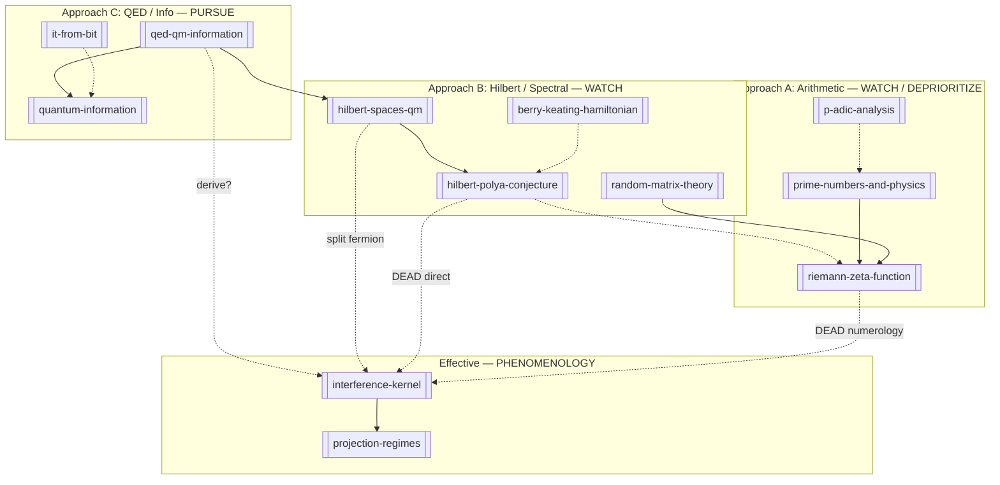

# Information–Reality Bridge Map

> **Note:** This map is superseded for **strategy** by [[multi-sided-bridge-framework]] and for **verdicts** by [[plausibility-register]]. Kept as visual catalog of islands.

## Status Legend on Edges

- **Solid** — established or pursue
- **Dashed** — watch / conjecture
- **Red (dead)** — implausible or refuted

## Island Diagram (with plausibility)

## Bridge Table (with verdicts)

| From | To | Claim | Verdict |
|------|-----|-------|---------|
| [[qed-qm-information]] | [[hilbert-spaces-qm]] | QM amplitudes on Hilbert space | **established** |
| [[qed-qm-information]] | [[quantum-information]] | Entropy, channels from QM | **pursue** |
| [[hilbert-spaces-qm]] | [[interference-kernel]] | Overlaps → Yukawa texture | **pursue** (derive) |
| [[riemann-zeta-function]] | [[random-matrix-theory]] | GUE-like zero spacings | **established** (partial) |
| [[hilbert-polya-conjecture]] | [[riemann-zeta-function]] | Zeros = eigenvalues | **open** |
| [[random-matrix-theory]] | [[interference-kernel]] | Shared GUE → same physics | **dead** — [[why-not-zeta-flavor-numerology]] |
| [[interference-kernel]] | [[projection-regimes]] | Sector regimes | **phenomenology** |
| [[interference-kernel]] cross-sector | parameter transfer | Universal parameters | **refuted** — [[repo-scientific-findings]] |
| [[prime-numbers-and-physics]] | [[qed-qm-information]] | Primes in QED sums | **watch** — [[can-primes-enter-via-qed-spectral-sums]] |
| [[p-adic-analysis]] | [[interference-kernel]] | Ultrametric hierarchy | **deprioritize** |
| [[it-from-bit]] | [[information-creates-reality]] | Ontological priority of bits | **philosophical** |

## Recommended Gap-Crossing Order

1. [[qm-to-information-what-is-measurable]] (C)
2. Split-fermion derivation of [[interference-kernel]] (B→D)
3. Hilbert–Polya independent of flavor (B→A)
4. Only then: primes/p-adics if a **specific hook** appears

See [[multi-sided-bridge-framework]] for full protocol.
