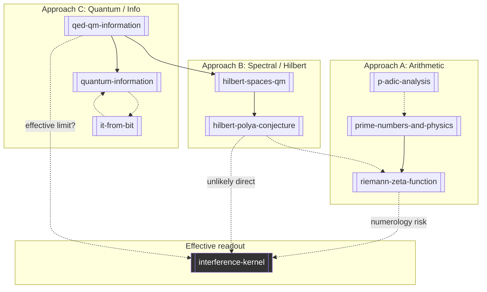

# Multi-Sided Bridge Framework

Math and reality can be approached from **three independent directions**. This wiki tracks each approach, where they agree, where they contradict, and **where bridges are plausible vs. dead ends**.

## The Three Approaches

| Approach | Starting point | Natural language | Core objects | Wiki hub |
|----------|----------------|------------------|--------------|----------|
| **A — Arithmetic** | Primes, zeta, p-adics | "Number structure is fundamental" | Primes, \(\mathbb{Q}_p\), L-functions | [[prime-numbers-and-physics]], [[p-adic-analysis]], [[riemann-zeta-function]] |
| **B — Spectral / Hilbert** | Self-adjoint operators | "Reality is spectrum" | Hilbert space, eigenvalues, phases | [[hilbert-spaces-qm]], [[hilbert-polya-conjecture]] |
| **C — Quantum / Info** | QED, measurement, entropy | "Reality is what survives observation" | Path integrals, density matrices, bits | [[qed-qm-information]], [[it-from-bit]], [[quantum-information]] |

**Repo phenomenology (D — Effective):** [[interference-kernel]] fits flavor data but is **not** a fundamental starting point — it is a readout layer to be explained by A/B/C or refuted.

## Convergence Points (Where Sides Can Meet)

These are **candidate bridges**, not established links. Each has a plausibility rating in [[plausibility-register]].

### Bridge 1: Spectrum (B ↔ A)

**Claim:** Zeta zeros = eigenvalues of some \(H\) on a Hilbert space.

| From A | From B | Gap |
|--------|--------|-----|
| Zero statistics (GUE) | Chaotic quantum spectra (GUE) | **No explicit \(H\)** — Hilbert–Polya open 110+ years |
| Prime counting ↔ zero density | Spectral density of \(H\) | Known *if* operator exists |

**Plausibility:** Medium for operator existence in abstract; **Low** for direct flavor connection without scale/structure argument.

### Bridge 2: Quantum phases (C ↔ B)

**Claim:** QED/QM on Hilbert spaces produces the phases and amplitudes that look like [[interference-kernel]] overlaps.

| From C | From B | Gap |
|--------|--------|-----|
| \(\langle i|e^{-iHt}|j\rangle\) amplitudes | Self-adjoint \(H\), unitary evolution | Must derive **discrete flavor geometry** from continuous QFT |
| Path integral weights | Spectral measure | Extra-dimensional / brane localization story needed (split fermions) |

**Plausibility:** **High** that QM uses Hilbert spaces (established). **Low–Medium** that flavor Yukawas *specifically* come from a known \(H\) tied to arithmetic.

### Bridge 3: Primes via quantum (A ↔ C)

**Claim:** Prime structure enters physics through quantum effects (energy levels, scattering, information bounds).

| Mechanism | Example | Status |
|-----------|---------|--------|
| Semiclassical quantization | Berry–Keating \(H=xp\) | Heuristic; not self-adjoint |
| Prime-number quantum billiards | Connes, others | Research programs; no SM prediction |
| Information-theoretic bounds | Bekenstein, holography | Established bounds; not prime-specific |
| **Direct** "electron knows primes" | Popular speculation | **Implausible** — see [[plausibility-register]] |

**Plausibility:** **Medium** for primes appearing in *spectral* or *information* bounds indirectly; **Low** for primes *directly* encoding CKM/PMNS.

### Bridge 4: p-adics (A ↔ D)

**Claim:** p-adic numbers encode flavor hierarchy or internal coordinates better than real geometry.

| Argument for | Argument against |
|--------------|------------------|
| Ultrametric trees → hierarchical structure | SM gauge structure is not naturally p-adic |
| Adelic physics programs (Volovich, etc.) | No confirmed SM prediction from p-adic QM |
| p-adic strings (historical) | Largely abandoned for phenomenology |

**Plausibility:** **Low–Medium** as alternative geometry; worth tracking but **not** current best path to flavor fits.

### Bridge 5: It-from-bit (C → all)

**Claim:** Information is ontologically prior; math (primes, Hilbert spaces) describes constraint structure on bits.

| Strength | Weakness |
|----------|----------|
| Unifies measurement, entropy, holography | Not a constructive theory — no unique dynamics |
| Wheeler's participatory universe | "Bit" undefined at Planck scale |

**Plausibility:** **High** as research orientation; **Low** as near-term proof path without Bridge 2 or 6.

### Bridge 6: QED → Information (C reverse direction)

**Claim:** Start from established QED/QM, **derive** information measures (entropy production, decoherence, channel capacity) — then ask whether arithmetic structure appears in those measures.

**This is the most grounded path:** physics → information → (maybe) arithmetic, not arithmetic → flavor by analogy.

See [[qed-qm-information]] and query [[qm-to-information-what-is-measurable]].

## Gap-Crossing Protocol

When two islands look connected, run this checklist before adding a bridge edge:

1. **Direction:** Is the arrow A→B or B→A? Reverse implications often fail.
2. **Scale:** Does the bridge work at 3×3 (flavor) or only at \(N\to\infty\) (RMT)?
3. **Falsifier:** What observation would **kill** this bridge? If none, mark speculative only.
4. **Independent evidence:** One shared statistic (e.g. GUE) is **not** enough — see [[why-not-zeta-flavor-numerology]].
5. **Plausibility register:** Update [[plausibility-register]] with verdict: **pursue**, **watch**, **deprioritize**, **dead**.

## Recommended Research Order

**Flavor phenomenology tranche (repo):** complete — see [[future-work]] Tier 0–3. Do not resume geometry grids or flavor numerology.

**Conjecture program (Tier 5):** see [[conjecture-to-physics-avenues]]; B↔A hub [[trace-formula-bridge-ladder]] (T5.1 complete).

1. **B ↔ A:** Explicit formula / trace formulas — primes ↔ zero heights (diag 14 extension); Hilbert–Polya **independent of flavor**
2. **B → D (falsifiable):** Jacobi / Sturm–Liouville inverse for kernel phases — [[does-phase-structure-imply-spectral-operator]]; split-fermion magnitude path **refuted** (diag 33)
3. **B (meta):** Large-N optimization landscape vs RMT — not 3×3 Yukawa spacing
4. **C → B:** QED on Hilbert space (established); QIT→flavor mechanism **closed** (diag 12–19)
5. **A ↔ C:** Primes in QED sums — **watch** until standard observable hook ([[can-primes-enter-via-qed-spectral-sums]])
6. **D:** Phenomenology paper only — kernel is readout, not fundamental

## Mermaid: Three Approaches + Effective Layer

Solid = established direction of inference. Dashed = conjectured or low-plausibility.
