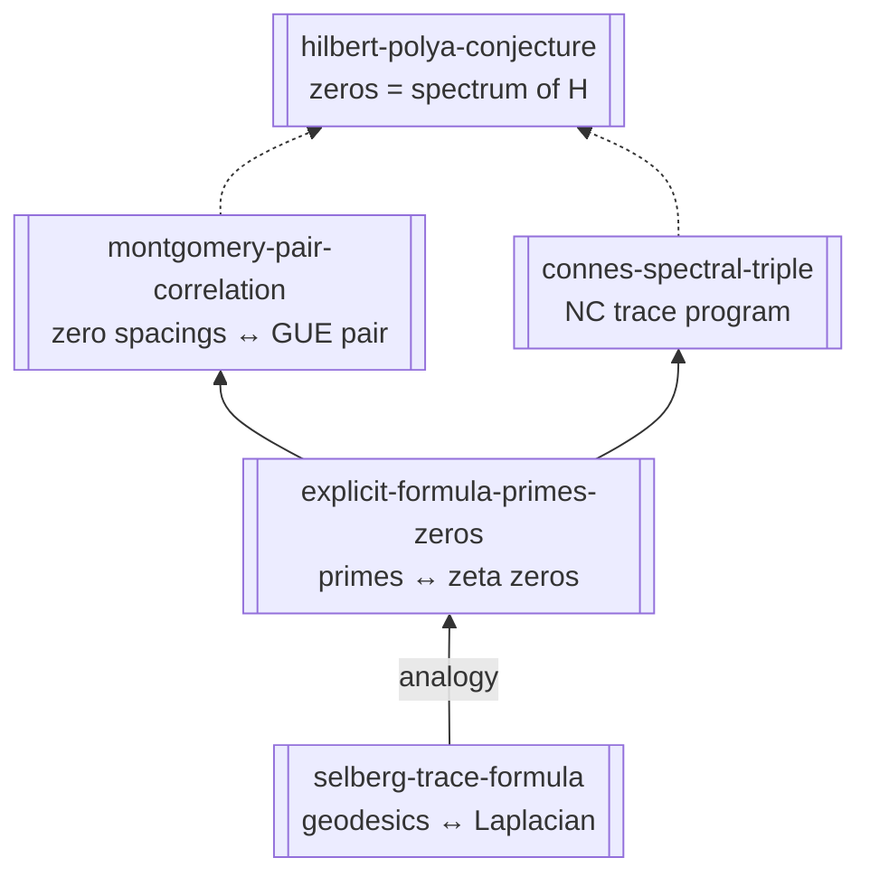

# Trace Formula Bridge Ladder

**Tier 5.1 ingest hub.** Connects proved trace/explicit identities to open operator conjectures — **decoupled from SM flavor**.

## Ladder

## Status matrix

| Node | Mathematics | “Physics” contact | Flavor repo |
|------|-------------|-------------------|-------------|
| Selberg | **Proved** for cofinite \(\Gamma\) | Quantum chaos / hyperbolic billiards | None |
| Explicit formula | **Proved** (conditional on zero-free region) | Computable \(\psi(x)\), \(\pi(x)\) | diag 14 only |
| Montgomery | **Proved** pair correlation **if RH** | None direct | **Dead** 3×3 link |
| Hilbert–Polya | **Open** | Would make zeros “energy levels” | **Watch** |
| Connes | **Framework**; operator **open** | Speculative spectral measure | **Watch** |

## Assumed-true vs proved (reader discipline)

| Belief | Actually established |
|--------|----------------------|
| “RH is true” | **Not proved** — but explicit formula and error terms are studied under RH or weaker hypotheses |
| “Zeros look GUE” | **Pair** correlation conditional on RH; full GUE **not proved**; high-zero numerics strong |
| “An operator exists” | **Conjecture** (Hilbert–Polya); Connes gives a **program**, not a verified \(H\) |
| “Therefore CKM comes from zeros” | **Refuted** in this repo — [[why-not-zeta-flavor-numerology]] |

## Next code (Tier 5.2+)

| ID | Script | Builds on |
|----|--------|-----------|
| T5.2 | `diagnostics/34_*` | diag 14 — frequency stability of \(\psi(x)-x\) vs \(\gamma_n\) |
| T5.3 | `diagnostics/35_*` | Jacobi inverse — **different** bridge (B→D), not this ladder |

## Canonical ingests (T5.1)

- [[explicit-formula-primes-zeros]] — concept + `raw/sources/explicit-formula-primes-zeros.md`
- [[selberg-trace-formula]] — concept + `raw/sources/selberg-trace-formula.md`
- [[montgomery-pair-correlation]] — `wiki/sources/` + raw
- [[connes-spectral-triple]] — `wiki/sources/` + raw

## See also

[[conjecture-to-physics-avenues]], [[plausibility-register]], [[proven-vs-conjecture-ledger]]
